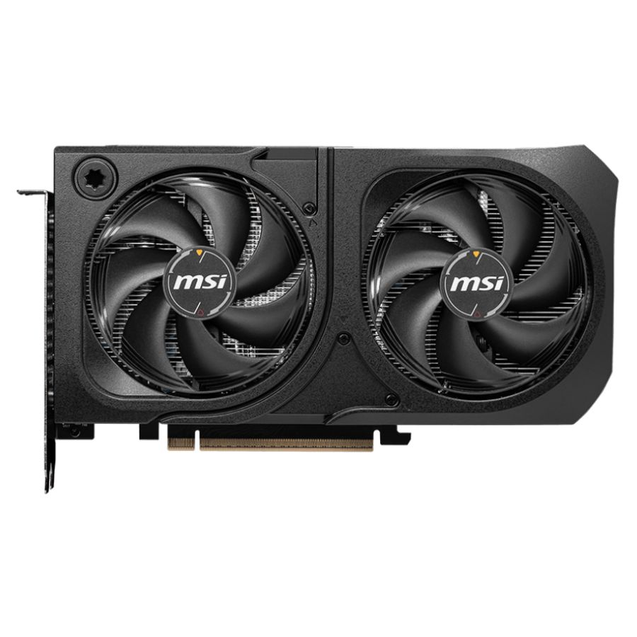

## 2026-0627

### Regeneración de Datos Sintéticos

* Modificados los scripts `airsim_commander.py` y `airsim_iterator.py` para soportar trayectorias completas como comando y para recibirlas por línea de comando.
* Subido video [AirSim Plugin on UE 5.5 synthetic telemetry for Drone 1 trajectory](https://youtu.be/LGso1VYQsPY) con muestra de generación de telemetría sintética del drone 1 (trayectoria en azul)
* Subido video [AirSim Plugin on UE 5.5 synthetic telemetry for Drone 2 trajectory](https://youtu.be/xgItxxe4yRM) con muestra de generación de telemetría sintética del drone 2 (trayectoria en marrón)
* Regeneración de telemetría sintética con trayectorias de vuelos reales.
* Análisis de [Variabilidad de Telmetría de Vuelos Simulados vs Drones Reales](https://github.com/georgsmeinung/lm-drone/blob/main/callibration_flight/telemetry_analysis_20260627.ipynb) con nueva telemetría sintética generada el 2026-0627, generando reporte en notebook de Jupyter con estadísticas descriptivas y pruebas estadísiticas para determinar si existen diferencias significativas entre las distribuciones de los datos de telemetría simulados y reales. 

#### Comparación Drone 1


#### Comparación Drone 2


* Al contrastar la telemetría real frente a la simulada en las trayectorias específicas del 2026-06-27 para Dron 1 y Dron 2, concluimos lo siguiente:

1. **Variabilidad y Rigidez Física (Giro):**
   - Al igual que en la fecha anterior, las pruebas de Levene confirman una varianza de actitud significativamente diferente ($p \ll 0.05$). En la simulación (AirSim), el dron experimenta inclinaciones laterales y frontales extremas durante los giros rápidos para generar la aceleración requerida y seguir los puntos de la trayectoria instantáneamente.
   - En cambio, los drones reales (DJI) están restringidos electrónicamente por el controlador PID de estabilización (típicamente limitado a $\pm 30^\circ$), mostrando una varianza mucho menor y acotada durante las maniobras.
   
2. **Segregación por Trayectoria:**
   - La segregación por trayectorias ha permitido aislar correctamente el comportamiento inercial y de control en dos perfiles distintos. 
   - El **Dron 1** experimenta giros de rumbo menos frecuentes y más simples (rectángulo), por lo que las aceleraciones se concentran principalmente en las esquinas.
   - El **Dron 2**, con su patrón de cruz y rectángulo continuo, presenta una dinámica transicional mucho más exigente y ruidosa, lo que exacerba las oscilaciones de roll y pitch en la simulación y demanda correcciones más frecuentes en el dron real.

3. **Ruido Ambiental y Estocasticidad:**
   - Durante las fases **rectas**, la telemetría simulada en AirSim es idealizada (varianza de actitud cercana a 0), sin fuerzas externas de viento ni ruido de sensores.
   - El dron real, por otro lado, manifiesta una variabilidad permanente de $\pm 2^\circ - 3^\circ$ en roll y pitch incluso en tramos rectos estables, producto del viento real de la zona y de las correcciones del piloto automático.

### La optimización de Modelos de Lenguaje Pequeños (SLM) con LoRA (Low-Rank Adaptation) 


Para mejorar la navegación y respuesta del SLM corriendo abordo se considera **LoRA (Low-Rank Adaptation)**, que es una estrategia altamente eficiente que forma parte de las técnicas de **Ajuste Fino Eficiente en Parámetros (PEFT)**.  
LoRA optimiza los modelos funcionando mediante una **descomposición de bajo rango**: actualiza solo un subconjunto muy pequeño de parámetros (o afina unas pocas capas específicas) mientras mantiene fijos la mayor parte de los parámetros del modelo preentrenado original.

La aplicación de LoRA en SLMs aporta las siguientes ventajas y características fundamentales:

* **Eficiencia de recursos:** Al actualizar solo una fracción de la red, LoRA **reduce drásticamente los costos computacionales y los requisitos de memoria** asociados con el proceso de ajuste fino (fine-tuning), haciéndolo mucho más ligero y accesible.  

* **Agilidad extrema:** El ajuste de un SLM utilizando LoRA requiere **solo unas pocas horas de procesamiento en GPU**. Esto permite a los desarrolladores un ciclo de iteración muy rápido para agregar nuevos comportamientos, corregir errores o especializar el modelo de la noche a la mañana, en lugar de esperar semanas.  

* **Prevención del sobreajuste (Overfitting):** Dado que la mayor parte del modelo original permanece inalterada, LoRA ayuda a **preservar el conocimiento preentrenado del modelo**, reduce el riesgo de sobreajuste y mejora la flexibilidad.  

* **Especialización de dominio:** Es el método ideal para adaptar un SLM general a **conjuntos de datos de dominios específicos o aplicaciones de nicho**. Por ejemplo, un modelo puede optimizarse de forma rápida con LoRA sobre documentos legales para crear un asistente de análisis de contratos, o sobre manuales técnicos para desarrollar una guía de resolución de problemas 

* **Variantes avanzadas y facilidad de uso:** Su implementación hoy en día es sencilla gracias a bibliotecas como peft de Hugging Face, que permiten configurar rápidamente los parámetros de la adaptación. Además, existen variantes populares empleadas en SLMs como **QLoRA** (que cuantiza el modelo para reducir aún más el consumo de recursos) y **DoRA**, que expanden la capacidad de ajustar modelos bajo restricciones de hardware.

### Optimización de Modelos mediante Decodificación Restringida
Además de LoRA para hacer obtener ordenes de navegación estructuras se considera utilizar gramátias reducidas para formatear las salidas.La generación de salidas estructuradas y la mejora en la eficiencia de la inferencia se logra principalmente a través de una técnica conocida como **decodificación restringida (constrained decoding)**.  

**Generación de salidas estructuradas:**
* La decodificación restringida interviene en el proceso de generación del modelo evaluando las reglas de una gramática o restricción dada y **enmascarando (ocultando) los tokens que son inválidos** en cada paso .  
* Al hacer esto, el modelo es guiado para que tome muestras únicamente de tokens válidos, lo que garantiza que la salida final se ajuste perfectamente a la estructura predefinida, siendo **JSON Schema** el estándar predominante en la industria para definir estos formatos.  
* Para lograr esto, se han desarrollado motores de gramática y marcos de trabajo optimizados como Guidance, Outlines, Llamacpp y XGrammar, los cuales traducen estas reglas para controlar las respuestas del modelo.  
* En el caso específico de los SLM integrados en sistemas de agentes autónomos, mantener formatos estrictos (como JSON, XML o código Python) es vital para comunicarse con otras herramientas. Las fuentes sugieren que los SLM pueden ser ajustados (fine-tuned) de forma económica para forzar una única decisión de formato, evitando así alucinaciones estructurales que rompan el código del sistema.

**Mayor eficiencia en la inferencia:**Aunque aplicar gramáticas o restricciones podría parecer un proceso que añade carga computacional, las implementaciones optimizadas en realidad **pueden acelerar el proceso de generación hasta en un 50%** en comparación con la generación sin restricciones. Esto se logra mediante varias optimizaciones clave:

* **Procesamiento en paralelo:** El cálculo de la máscara de tokens permitidos se ejecuta en paralelo con el paso hacia adelante (forward pass) del modelo de lenguaje.  
* **Compilación simultánea:** La compilación inicial de la gramática requerida se realiza de manera concurrente con los cálculos de pre-llenado (pre-filling) del prompt inicial.  
* **Optimizaciones avanzadas:** Los sistemas emplean técnicas como el almacenamiento en caché de gramáticas y la decodificación especulativa basada en restricciones para reducir los tiempos de respuesta. Además, marcos como *Guidance* alcanzan una eficiencia sobresaliente al ser capaces de acelerar y saltarse directamente ciertos pasos de generación cuando la gramática los hace predecibles.

## 2026-0626

* Explorando usar [Ollama](https://ollama.com/) directamente en vez de [LMStudio](https://lmstudio.ai/)
* LMStudio es muy útil explorar modelos, su rendimiento y configuración de inferencia óptima pero Ollama parece tener más eficiencia para construir soluciones. 
* Posiblemente para una instalación en un dispositivo Edge, con bajo poder de cómputo como una companion computer del drone, probablemente [llama.cpp](https://llama.app/) sea la mejor opción.
* Corrección de infografías generadas por IA con [Nano Banana](https://gemini.google/tm/overview/image-generation/?hl=en-TM) a través de la app de escritorio de [Gemini](https://gemini.google.com/app)
* Instalación de [openai/gpt-oss-20b](https://huggingface.co/openai/gpt-oss-20b) en Ollama directamenete desde el repositorio de Hugging Face de OpenAI:
``` Bash
# gpt-oss-20b
ollama pull gpt-oss:20b
ollama run gpt-oss:20b
```
* `gpt-oss-20b` is recommeded for lower latency, and local or specialized use cases (21B parameters with 3.6B active parameters)
* Igual tiene tiempo tiempos de respuesta altos para el proposito del prototipo y no es SLM. Prueba simple de conversación:
```
total duration:       50.381895541s
load duration:        228.9805ms
prompt eval count:    75 token(s)
prompt eval duration: 2.533294s
prompt eval rate:     29.61 tokens/s
eval count:           918 token(s)
eval duration:        47.494863s
eval rate:            19.33 tokens/s
```
* Probando con el modelo [LiquidAI/LFM2.5-8B-A1B](https://huggingface.co/LiquidAI/LFM2.5-8B-A1B). Prueba de conversación simple:
```
total duration:       17.997622792s
load duration:        135.492042ms
prompt eval count:    15 token(s)
prompt eval duration: 162.112ms
prompt eval rate:     92.53 tokens/s
eval count:           1399 token(s)
eval duration:        17.698413s
eval rate:            79.05 tokens/s
```
* Primera implementación del loop de control en `airsim-loop`
* Primera implementación del planificador en `airsim-plan`
* Subido video ["AirSim Plugin on UE 5.5 Trajectory Auditory and RGB Video Capture at 720p"](https://youtu.be/BkV4tYFSrrs) para determinar el comportamiento del piloto automático en trayectorias porgramadas 


* Activada la opción de traza del Airsim (linea violeta flotando destrás del drone en el video). La falta de saltos de una trayectoria conocida de antemano por el piloto automático sugiere que procesa la aceleración más ordenadamente que con comandos separados. Esto puede se la explicación de las desacelearaciones brusas en las pruebas de generación de telemetría sintética. Habría que repetir el experimento con trayectorias en lugar de comandos aislados.
* Aunque el render del editor de Unreal Engine tenga algunos saltos, la captura de video de la cámara de abordo muestra el vuelo correctamente renderizado y sin saltos.
* Configuración en AirSim `settings.json` para subir la resolución de la camára del dron a 1080x720p. El archivo queda así:
``` JSON
{
  "SeeDocsAt": "https://github.com/Cosys-Lab/Cosys-AirSim/blob/main/docs/settings_example.json",
  "SettingsVersion": 2.0,
  "SimMode": "Multirotor",
  "LocalHostIp": "0.0.0.0",
  "ApiServerPort": 41451,
  "RecordUIVisible": false,
  "ClockType": "SteppableClock",
  "OriginGeopoint": {
    "Latitude": 47.641468,
    "Longitude": -122.140165,
    "Altitude": 122
  },
  "CameraDefaults": {
    "CaptureSettings": [
      {
        "ImageType": 0,
        "Width": 1080,
        "Height": 720
      },
      {
        "ImageType": 3,
        "Width": 1080,
        "Height": 720
      },
      {
        "ImageType": 5,
        "Width": 1080,
        "Height": 720
      },
      {
        "ImageType": 1,
        "Width": 1080,
        "Height": 720
      }
    ]
  }
}
```
* Con esta resolución se puede empezar la prueba del procesamiento YOLO y del SLM del loop del control del drone
* También fue necesario ajustar el renderizado del escena a `Epic` para tener una imagen monocular utilizable.

## 2026-0625

### Diseñando solución de Nagevación con SLM y LangGraph para comenzar el prototipado


* Bucle de Navegación implementado con LangGraph
  - **Paso 1: Captura Sensorial.** El inicio del ciclo donde la API de AirSim proporciona imágenes RGB y telemetría crítica.
  - **Paso 2: Traducción Píxeles-a-Palabras.** El primer filtro de IA local. YOLOv8 o un modelo similar toma la imagen y genera coordenadas matemáticas. Nuestro código traduce instantáneamente estas coordenadas en conceptos textuales estructurados: el tipo de objeto, su ubicación en el encuadre (Izquierda, Centro, Derecha) y una estimación de proximidad.
  - **Paso 3: El "Gatekeeper" de LangGraph.** El nodo condicional decisivo. Aquí se aplica la lógica para ahorrar cómputo: si no hay un obstáculo inminente detectado al frente en el sector central, el flujo se desvía directamente al control reactivo. Si el camino está bloqueado, se dispara el nodo del cerebro.
  - **Paso 4A: Reflejo Rápido (Control Reactivo).** Una ruta de cómputo casi nulo. Al no haber peligro inmediato, el planificador reactivo decide mantener el rumbo por defecto, ahorrando valiosos ciclos de CPU del LLM.
  - **Paso 4B: Cerebro Deliberativo (SLM Local).** La ruta deliberativa. El SLM local (Phi-3 o Llama-3 en LM Studio) recibe el resumen textual detallado de la escena. Analiza, razona y genera un plan de evasión específico, como "esquivar por la derecha para evitar el árbol detectado al frente".
  - **Paso 5: Ejecución Motriz: El nodo final del ciclo.** Traduce la decisión de macro-acción (ya sea "mantener rumbo" o "esquivar por la derecha") en comandos directos de velocidad para la API de AirSim, moviendo físicamente el dron.
  - **Paso 6: Bucle Continuo.** El ciclo se cierra y comienza inmediatamente de nuevo, permitiendo una navegación autónoma y sensible al entorno en tiempo real.

* NOTAS
  - Para capturar el feed de video en tiempo real de AirSim y poder procesarlo YOLO, hay que  hacer capturas de imágenes en un bucle continuo como el presentado.
  - Para procesar una cámara monocular RGB en tiempo real y alimentar un Small Language Model (SLM) local sin colapsar la GPU, debemos aplicar el paradigma "Píxeles a Palabras" (Pixel-to-Text).
  - Dado que el SLM procesa texto a una velocidad menor (latencia de 100-300ms) que la captura de la cámara (30 FPS o ~33ms), el pipeline debe estar desacoplado. El procesamiento de imágenes (YOLO/OpenCV) corre a máxima velocidad, y LangGraph actúa como el orquestador deliberativo que decide cuándo consultar al SLM según el estado del entorno.
  - El flujo de procesamiento transforma los datos ópticos crudos en vectores de estado textuales que el SLM pueda entender perfectamente.
    1. Captura Frecuente (High-Frequency Loop): OpenCV extrae el frame RGB de AirSim.
    2. Compresión Espacial (Local Vision AI): YOLOv8-nano procesa el frame. Transforma las cajas de colisión bidimensionales ($x_1, y_1, x_2, y_2$) en conceptos relativos: Izquierda, Centro, Derecha y Tamaño (el tamaño relativo en una cámara monocular estima la cercanía).
    3. Inyección al Estado de LangGraph: El estado del dron se actualiza con la semántica del entorno.
    4. Evaluación de Disparadores (Gatekeeper): Si el camino está despejado, se ejecuta control directo (rutina estándar). Si se detecta un cambio o un obstáculo, se dispara el nodo del SLM.

### Diseñanando solución de Planificación de Misión para comenzar el prototipado
El complemento necesario para el sistema de navegación autonoma a bordo es la contraparte terrena que genera el manifiesto de vuelo


El operador de vuelo sigue este flujo para la planificación:
  1. **Estación Terrena (Planificación).** El operador interactúa con una interfaz visual local, definiendo la ruta (Waypoints) y las reglas de seguridad sin necesidad de código complejo.
  2. **Manifiesto de Misión (El Contrato JSON).** La estación terrena compila las entradas del usuario en un archivo JSON estricto. Este documento es la fuente de la verdad para el dron, conteniendo coordenadas relativas y umbrales críticos (como el de la batería).
  3. **Inyección en LangGraph.** El archivo JSON se carga directamente en el estado inicial (AutonomousMissionState) del script de Python antes del despegue, pre-cargando la memoria del dron con su objetivo.
  4. **Ejecución a Bordo (El Navegador Estratégico).** Ya en vuelo, el nodo estratégico consulta constantemente este plan para dirigir al dron hacia el siguiente waypoint, delegando el control al SLM táctico (como Phi-3) únicamente si los sensores detectan un obstáculo imprevisto en la ruta.


## 2026-0624

* Revisión de documentación actualizad de [Cosys-AirSim](https://cosys-airsim.com/)
* Revisión de [configuración de Cosys-Airsim](https://cosys-lab.github.io/Cosys-AirSim/settings/)
* Revisión versiones en [repositorio GitHub de Cosys-Airsim](https://github.com/Cosys-Lab/Cosys-AirSim)

## 2026-0623

* Revisión y ordenamiento de CHANGELOG.MD

## 2026-0622

* Optimización de escena `Small_City_LVL` de ["City Sample"](https://www.fab.com/listings/4898e707-7855-404b-af0e-a505ee690e68), según las recomendaciones para ["lower spec systems"](https://dev.epicgames.com/documentation/unreal-engine/city-sample-project-unreal-engine-demonstration). Optmizado para visualización a distancia media con multitud y tráfico controlado con IA.
* Subido video ["AirSim Plugin on UE 5.5 running along AI traffic and crowds"](https://www.youtube.com/watch?v=mAna9kyDVSc) a YouTube mostrando vuelo con trafico y multitudes controlados por IA.


* El laboratorio Cosys-Lab de la Universidad de Amberes aborda la relación entre el rendimiento gráfico y la simulación física. En su paper oficial sobre la plataforma, titulado ["Cosys-AirSim: A Real-Time Simulation Framework Expanded for Complex Industrial Applications"](informe/bibliografia/2303.13381v3.pdf), detallan de forma específica cómo equilibrar la carga computacional. 
* **La postura de Cosys-Lab sobre gráficos vs. física**: El paper original de Cosys-AirSim resalta que, a diferencia del AirSim clásico de Microsoft (enfocado principalmente en cámaras RGB y visión por computadora), Cosys-AirSim añade sensores avanzados como LiDAR, Sonar y Radar basados en GPU y CPU. Por lo tanto, bajar la calidad visual del entorno al mínimo es una práctica recomendada y necesaria si tu objetivo principal es priorizar la tasa de actualización de la física y los sensores activos, evitando que el renderizado de texturas y luces sature los recursos. Por este motivo, no se reducen las texturas, pero si el post procesamiento para renderizado cinmático en "City Sample".
* **Recomendaciones específicas de configuración**: Para lograr este comportamiento y evitar cuellos de botella en la simulación física, la documentación de Cosys-Lab y las configuraciones de su repositorio exigen ajustar los siguientes parámetros:
    - Desactivar el ahorro de CPU en segundo plano: En el editor de Unreal Engine, ir a Edit -> Editor Preferences, buscar el término "CPU" y desmarcar obligatoriamente la casilla "Use Less CPU when in Background". Si no, la tasa de refresco de la física caerá drásticamente en cuanto la ventana pierda el foco. 
    - Ajuste del ClockSpeed: Cosys-AirSim permite modificar la velocidad del reloj de simulación en el archivo settings.json mediante el parámetro "ClockSpeed": 1. Si los fotogramas por segundo (FPS) bajan demasiado debido a la carga gráfica, recomiendan reducir este valor (por ejemplo, a 0.5) para ralentizar el tiempo de simulación y dar margen a que la física se calcule de manera precisa y sincronizada paso a paso. Útil para cálculo de interacción detallada con la meteorología.
    - Modo sin renderizado (NoDisplay Mode): Si no se necesita recolectar imágenes de cámaras visuales (No es el caso de la temática de esta tesis) y solo se requiere la telemetría, la física o los datos de sensores puros, se recomienda activar el "ViewMode": "NoDisplay" en el archivo de configuración. Esto anula por completo el esfuerzo de renderizado de la pantalla de Unreal Engine, multiplicando la velocidad del motor de física interno. 
    - Uso de binarios empaquetados (Packages): Cosys-Lab aconseja ejecutar la simulación a través del proyecto ya compilado y empaquetado (Standalone/Executable Binary) en lugar de correrlo directamente desde el Unreal Editor. La ejecución directa en el editor consume recursos masivos de memoria y procesamiento gráfico dedicados a la interfaz del software de desarrollo.

## 2026-0621

* Análisis de [Variabilidad de Telmetría de Vuelos Simulados vs Drones Reales](https://github.com/georgsmeinung/lm-drone/blob/main/callibration_flight/telemetry_analysis_20260610.ipynb) con nueva telemetría sintética generada el 2026-060, generando reporte en notebook de Jupyter con estadísticas descriptivas y pruebas estadísiticas para determinar si existen diferencias significativas entre las distribuciones de los datos de telemetría simulados y reales. 
* La segregación por trayectorias, imitando la de los drones reales, ha permitido aislar correctamente el comportamiento inercial y de control en dos perfiles distintos. 
* El **Dron 1** experimenta giros de rumbo menos frecuentes y más simples (rectángulo), por lo que las aceleraciones se concentran principalmente en las esquinas.


* El **Dron 2**, con su patrón de cruz y rectángulo continuo, presenta una dinámica transicional mucho más exigente y ruidosa, lo que exacerba las oscilaciones de roll y pitch en la simulación y demanda correcciones más frecuentes en el dron real.


* Además durante las fases **rectas**, la telemetría simulada en AirSim es idealizada (varianza de actitud cercana a 0), sin fuerzas externas de viento ni ruido de sensores.
* El dron real, por otro lado, manifiesta una variabilidad permanente de $\pm 2^\circ - 3^\circ$ en roll y pitch incluso en tramos rectos estables, producto del viento real de la zona y de las correcciones del piloto automático.

## 2026-0619

* Prueba de conexión desde server con servicio LLM a server con servicio AirSim y simulación
* Comunicación física mediante cable cruzado Ethernet.
* Entorno de trabajo remoto configurado en VS Code para Windows 11 a server remoto en Mac OS Tahoe
* Prueba de control desde host IA hacia host AirSim remoto OK.


## 2026-0612

* Depuración de configuración para tener el cliente de AirSime en un servidor separado
* Prepararción de entorno para ARM64
* Modificación de scripts para que tome la información del Host Airsim de un .env

## 2026-0611

* Configuración de servidor de inferencia en Mac mini con LMStudio:


```
      Model Name: Mac mini
      Model Identifier: Mac16,10
      Model Number: MU9D3LL/A
      Chip: Apple M4
      Total Number of Cores: 10 (4 Performance and 6 Efficiency)
      Memory: 16 GB
```
* Analizando modelos por debajo del 1B parámetros para inferencia razonablemente rápida
* Prueba de red por Ethernet entre los dos sistemas
* Prueba de fluidez de Unreal Engine sobre Remote Desktop Protocol. Funciona razonablemente. EL UE funciona mejor cuando se baja el viewport virtual
* La aceleración de la RTX 5060 no tiene efecto sobre el Remote Desktop. Se determina usar como estación de renderizado PC con la GPU



```
        Marketing Name: GeForce RTX™ 5060 8G GAMING OC 
        Model Name: G5060-8GC 
        Graphics Processing Unit: NVIDIA® GeForce RTX™ 5060
        Arquitecture: NVIDIA Blackwell (5 nm litography).
        Interface: PCI Express® Gen 5 x16 pin(uses x8) 
        Core Clocks: Extreme Performance: 2640 MHz (MSI Center) Boost: 2625 MHz 
        CUDA® CORES: 3840 Units 
        Memory Speed: 28 Gbps 
        Memory: 8GB GDDR7 
        Memory Bus: 128-bit 
        HDCP Support: Y 
        Power consumption: 155 W 
        Power connectors: 8-pin x 1 
        Recommended PSU: 550 W 
        Card Dimension (mm): 248 x 135 x 41 mm 
        Weight (Card / Package): 649 g / 966 g 
        DirectX Version Support: 12 Ultimate 
        OpenGL Version Support: 4.6 
        Maximum Displays: 4 
        G-SYNC® technology: Y 
        Digital Maximum Resolution: 7680 x 4320
```


## 2026-0610

* Generación de telemetría de los vuelos simulados con las mismas trayectorias que los reales, a la misma altura y la misma velocidad. 


* Vuelo simulado con la trayectoria del Drone 1. Los puntos de las trayectorias están redondeados a múltiplos de 5.
```
takeoff
move(0,0,-30,5)
move(245,-65,-30,5)
move(30,-45,-30,5)
move(30,95,-30,5)
move(-135,95,-30,5)
move(-135,-45,-30,5)
move(39,-45,-30,5)
move(245,-65,-30,5)
reset
```

* Vuelo simulado con la trayectoria del Drone 2. Los puntos de las trayectorias están redondeados a múltiplos de 5.
```
takeoff
move(0,0,-30,5)
move(50,-75,-30,5)
move(-45,-20,-30,5)
move(95,-20,-30,5)
move(95,-110,-30,5)
move(-100,-110,-30,5)
move(-100,110,-30,5)
move(125,110,-30,5)
move(-45,-20,-30,5)
move(50,-75,-30,5)
reset
```

* Subido video ["AirSim Plugin on UE 5.5 Calibration Flight with Drone 2 trajectory"](https://www.youtube.com/watch?v=xNnIMdziv5g) a YouTube mostrando uno de los vuelos de calibración.


## 2026-0605

* Reunión de Avance de Proyecto con Ezequiel para mostrar avances y analizar los resultados de las pruebas realizadas. Acuerdo para poner foco en los experimentos, el sandbox de Airsim con entornos dinámicos parece ser válido para los experimentos a realizar. Objetivo 1 de pipeline reproducible alcanzado, ahora poner foco en experimentos de los objetivo 2 y 3: procesamiento de datos se sensores en tiempo real para tomar decisiones de navegación con la intervención del un SLM; comparar este mecanismo de operación con el de un piloto automático tradicional basad en un FSM.
* Para mejorar la comparación, acuerdo para generar los vuelos simulados con las mismas trayectorias que los reales. Es necesario ver cuál es la velocidad de los vuelos reales porque no está explícita.
* Modificación del Notebool para [consolidar datos de telemtría de drones reales](https://github.com/georgsmeinung/lm-drone/blob/main/callibration_flight/actual_telemetry/consolidate_telemetry.ipynb) para calcular el cambio de velocidad en los tres ejes.
* Análisis de [Variabilidad de Telmetría de Vuelos Simulados vs Drones Reales](https://github.com/georgsmeinung/lm-drone/blob/main/callibration_flight/telemetry_analysis_20260610.ipynb) modificando reporte en notebook de Jupyter para analizar los cambios de velocidad en los tres ejes.

## 2026-0604

* Generado Notebook para [consolidar datos de telemtría de drones reales](https://github.com/georgsmeinung/lm-drone/blob/main/callibration_flight/actual_telemetry/consolidate_telemetry.ipynb)
* Análisis de [Variabilidad de Telmetría de Vuelos Simulados vs Drones Reales](https://github.com/georgsmeinung/lm-drone/blob/main/callibration_flight/telemetry_analysis_20260413.ipynb) generando reporte en notebook de Jupyter con estadísticas descriptivas y pruebas estadísiticas para determinar si existen diferencias significativas entre las distribuciones de los datos de telemetría simulados y reales. 


## 2026-0522

* AirSim funcionando en [City Sample](https://fab.com/s/5e8f5eda64d8), ambiente desnamente urbano. Con peatones y tráfico gestionado por IA autónoma de Unreal Engine.
* Airsim funcionando junto el modelo [liquid/lfm2.5-1.2b](https://lmstudio.ai/models/liquid/lfm2.5-1.2b) corriendo en lmstudio.


## 2026-0521

* Generando nuevo ambiente de pruebas con [Downtown West Modular Pack](https://fab.com/s/be5ea9a2cae4) para ambiente semi urbano con más realismo y configurando Cosys Airsim en el nuevo proyecto. Pruebas OK.

* Generando nuevo ambiente de pruebas con [City Sample](https://fab.com/s/5e8f5eda64d8) para ambiente desnamente urbano. Configurando Small_City_LVL para no consumir toda la VRAM.

## 2026-0509

* Generando nuevo ambiente de pruebas con [Dynamic City Creator](https://alidocs.dingtalk.com/i/nodes/jb9Y4gmKWrx9eo4dCqAq361yJGXn6lpz) y configurando Cosys Airsim en el nuevo proyecto. El Plugin de Airsim no detecta la red de colisiòn de la ciudad generada paramétricamente.

## 2026-0508

* Probando modelos Edge en la misma PC que corre Unreal Engine con GPU RTX 5060. Considerando:
  - [LFM2.5‑VL-450M](https://huggingface.co/LiquidAI/LFM2.5-VL-450M): Modelo edge de LiquiAI que soporta visión para el procesado de imágenes del drone. No tiene sentido usar esto sólo, un preprocesamiento con YOLO puede ayudar con una segmentación previa con una CNN más rápida. Este modelo es para la navegación y decisiones en tiempo real.
  - [LiquidAI/LFM2.5-1.2B-Thinking](https://huggingface.co/LiquidAI/LFM2.5-1.2B-Thinking):  modelo de 1.200 millones de parámetros que integra un proceso de razonamiento nativo (CoT), permitiéndo superar en lógica y programación a modelos siete veces más grandes. Su mayor ventaja es la eficiencia extrema, ya que requiere menos de 1 GB de RAM en su versión optimizada, lo que facilita la ejecución de agentes autónomos y tareas de código complejas directamente en dispositivos personales sin latencia ni dependencia de la nube. Este modelo es para planificación de la misión de vuelo. Un proceso de razonamiento nativo (o Chain-of-Thought - CoT) es una técnica donde el modelo de IA no responde de inmediato, sino que "piensa en voz alta" internamente antes de dar la respuesta final. Respuesta muy fluida: 224 TPS
  - [google/gemma-4-E4B](https://huggingface.co/google/gemma-4-E4B) con cuantizacion Q4. Implementación de KV Cache optimizada para una ventana de contexto de 32k tokens. Respuesta de 268 TPS
  - [liquid/lfm2-700m](https://huggingface.co/LiquidAI/LFM2-700M-GGUF) con cuantizacion Q4 y 64K de contexto. Respuesta de  344 TPS.

* Prueba de concepto con **LiquidAI/LFM2.5-1.2B** de control de drone, todo en memoria.

## 2026-0507

* Implementando servidor de inferencia en `Ubuntu 26.04 LTS`. Tareas implementar el servidor de inferencia ThinkPad T15 Gen 2 con **Kubuntu**.
* Pruebas con [**google/gemma-4-E4B**](https://huggingface.co/google/gemma-4-E4B) no dan buen rendimiento: menos 7 TPS.
* Considerando modelos Edge para trabajo agéntico, pruebas con:
  - [LiquidAI/LFM2-350M-GGUF](https://huggingface.co/LiquidAI/LFM2-350M-GGUF): LFM2 es una nueva generación de modelos híbridos desarrollados por Liquid AI, diseñados específicamente para IA en el borde y despliegue en dispositivos. Establece un nuevo estándar en términos de calidad, velocidad y eficiencia de memoria. Muy buena velocidad: 60 TPS.
  - [LiquidAI/LFM2-1.2B-GGUF](https://huggingface.co/LiquidAI/LFM2-1.2B-GGUF): LFM2-1.2B-Tool: Un modelo de 1.200 millones de parámetros diseñado específicamente para la llamada de funciones (function calling) y flujos de trabajo de agentes. Según los reportes, compite en ejecución de tareas con modelos mucho más grandes, como Qwen-8B y Gemma-12B. Menos velocidad pero todavia aceptable: 45 TPS.
  

## 2026-0506

* Reconsiderando un entorno distribuido entre dos plataformas para descargar trabajo de la RTX 5060 con VRAM limitada a 8GB, dejando la GPU dedicada a Unreal Engine 5.5 con Cosys Airsim.
* Diseño de Infraestructura de Inferencia de IA Local distribuida con este despliegue

#### Arquitectura de Inferencia Distribuida (Gemma 4 / Iris Xe)
##### 1. Nodo de Inferencia (Headless Server)
- Host: Lenovo ThinkPad T15 Gen 2 (Intel Core i5, Iris Xe 80 EUs).
- OS: Kubuntu (Kernel Linux 6.x / Mesa Drivers con soporte Vulkan anv).
- Memoria: 40 GB DDR4. El modelo se carga en el bloque inicial de 16 GB para aprovechar el Dual-Channel (Flex Memory), minimizando cuellos de botella en el ancho de banda.
- Backend: llmster (vía lms CLI). Ejecución optimizada mediante GPU Offloading (NGL) total sobre la iGPU para liberar ciclos de CPU.
- Modelo:  [**google/gemma-4-E4B**](https://huggingface.co/google/gemma-4-E4B) con cuantizacion Q8_0. Implementación de KV Cache optimizada para una ventana de contexto de 32k tokens.

##### 2. Capa de Aplicación y Red
- Protocolo: API REST compatible con OpenAI (v1) expuesta en 0.0.0.0:1234.
- Orquestación: Despliegue de Open WebUI mediante contenedor Docker en el host de Windows 11, vinculado al endpoint remoto por LAN.
- Integración IDE: Conexión vía OpenCode / VS Code para telemetría y generación de código local (Local Code-Reviewer).

##### 3. Implementación Agéntica
- Framework: OpenClaw o CreoAI para ejecución de herramientas locales y Gemini CLI (MCP) como fallback híbrido para contextos extensos (128k+).
- Control de Potencia: Configuración de perfil de energía performance en Linux para evitar el throttling térmico del SoC durante la inferencia sostenida.

## 2026-0504

* Intento de desplegar entorno en Linux con Unreal Engine for Linux
* El entorno es muy inestable

## 2026-0415

* Generado una versión más avanzada de control por teclado
* Cambiando modo de control por teclado a posición relativa a la orientación del drone

## 2026-0413

* Reunión avance de Tesis con Ezequiel y determinación de próximos pasos.
* Decargado datos de  telemetría real de drones cuadricópteros en https://zenodo.org/records/15912415
* Creado script de iteración apara generar telemetría automatizada de al menos 100 vuelos simulados
* Generados telemetria de 100 vuelos simulados

## 2026-0409

* Generado script de vuelo de calibración y archivo de comandos
* Ejecutados los 10 primeros vuelos de calibración. Cada vuelo individual tiene la telmetría registrada en un .CSV separado

## 2026-0402

* En preparación para vuelos de calibración, agregada la condicion de reset para detener el `airsim_logger.py` (escritura de telemetría a archivos)

## 2026-0331

* Los modelos Qwen no están interpretando bien los comandos y el Phi 4 no es eficiente. Probando con modelo: [**nvidia/nemotron-3-nano-4b**](https://lmstudio.ai/models/nvidia/nemotron-3-nano-4b)
* Determinada plataforma para calibración: Drone con nvidia/nemotron-3-nano-4b. Funciona mejor sin el modo thinking, para no llenar la ventana de contexto muy rápidamente.

## 2026-0313

* Probando una versión destilada de Claude 4.6 Opus para evitar consumir muchas VRAM: [**Jackrong/Qwen3.5-2B-Claude-4.6-Opus-Reasoning-Distilled-GGUF**](https://huggingface.co/Jackrong/Qwen3.5-2B-Claude-4.6-Opus-Reasoning-Distilled-GGUF) funciona ocupando sólo 1.69 GB con cuantización de 4 bits  y venta de contexto de 8192 tokens.
* Conectado Claude Code con modelo local `Jackrong/Qwen3.5-2B-Claude-4.6-Opus-Reasoning-Distilled-GGUF` corriendo en LMStudio, pero tuve que subir la ventana de contexto a 32768 por la cantidad de system promps que envia Claude.

## 2026-0312

Buscando opciones para mejorar la capacidad agéntica del despliegue sin consumir muchas VRAM. Dado que se está usando una RTX 5060 (8 GB) y se necesita mantener a Unreal Engine funcionando sin problemas, cada megabyte de VRAM cuenta. 
[**Qwen2.5‑Coder‑1.5B‑Instruct**](https://huggingface.co/Qwen/Qwen2.5-Coder-1.5B-Instruct-GGUF) es una buena opción en este escenario. Con cuantización **Q4\_K\_M**, tiene una huella de aproximadamente **\~1.1 GB**.

**Cómo ajustarlo para que entre en 2 GB (dejando 6 GB para Unreal)**
Para asegurar que el LLM se mantenga estrictamente dentro de 2 GB y no interfiera con la simulación, se usarán estos ajustes específicos en **LM Studio 0.4.1**:

**1. Ventana de contexto** configurada en **8.192 (8k)**. Es crucial habilitar **4‑bit KV Cache (Flash Attention)** en la configuración de LM Studio.  Esto reduce el costo de VRAM de la “memoria” en un **50 %**. Un contexto de 8k en 4‑bit ocupará solo unos **\~150 MB**, mientras que 32k se comería casi **1 GB**.

**2. Offload a GPU** en **Max (todas las capas)**. Si las capas se desbordan a la RAM del sistema (CPU), la velocidad de generación de tokens caerá significativamente, lo que puede hacer que agentes como **Claude Code** haga *timeout* durante tareas complejas.

**3. Estabilidad entre aplicaciones**. En el **Panel de Control de NVIDIA**, setear **“Background Application Max Frame Rate”** para que esté limitado para LM Studio a **20–30 FPS**. Esto evita que la interfaz del LLM compita con Unreal por los recursos de la GPU. 

**Consideraciones adionales: ¿Por qué no usar BitNet aquí?**
Aunque **BitNet (1.58‑bit)** usa aún menos VRAM (**\~0.4 GB**), requiere **bitnet.cpp** o *kernels* especializados. Dado que **LM Studio 0.4.1** todavía no soporta de forma nativa la arquitectura BitNet, se perdería la conveniencia del nuevo endpoint “compatible con Anthropic”. **Qwen 1.5B** es un buen equilibrio entre compatibilidad nativa con LM Studio y bajo consumo de recursos.

**Configuración (PowerShell)**
Una vez que el servidor esté corriendo en el puerto **1234** en LM Studio:
```powershell
# Windows PowerShell
$env:ANTHROPIC_BASE_URL="http://localhost:1234/v1"
$env:ANTHROPIC_API_KEY="lm-studio"
claude
```
Si Unreal Engine empieza a dar lags en el render, revisar el uso de VRAM en la barra inferior de LM Studio. Si supera **1.8 GB**, bajar la ventana de contexto a **4.096**.

* Modelo Qwen2.5‑Coder‑1.5B‑Instruct funcionando correctamente con MCP server de AirSim

## 2026-0310

* Generada una versión funcional del Airsim Drone MCP server
* Pruebas de conexión y funcionamiento del loop de eventos de Airsim y el MCP


## 2026-0304

* Instalado https://huggingface.co/DevQuasar/HuggingFaceTB.SmolLM2-135M-Instruct-GGUF en lmstudio. 
* `HuggingFaceTB/SmolLM2-135M` no es muy bueno interpretando comandos.
* Probando con:
```
Model: Qwen/Qwen2.5-Coder-0.5B-Instruct
Provider: Alibaba
Parameters: 494M
Best Quant: Q8_0 (for this hardware) 
Context: 32768 tokens
Use Case: Code generation and completion
```
* `Qwen/Qwen2.5-Coder-0.5B-Instruct` funciona bien para procesar comandos simples

## 2026-0303

* Determinando mejor llm local con `llmfit`. 
Seleccionado:
```
Model: HuggingFaceTB/SmolLM2-135M
Provider: huggingfacetb
Parameters: 135M
Quantization: Q4_K_M
Best Quant: Q8_0 (for this hardware)
Context: 8192 tokens
Use Case: General purpose text generation
Category: General
Released: 2024-10-31
Runtime: llama.cpp (baseline est. ~1046.7 tok/s)
Installed: No provider running
```

## 2026-0212

### Small Language Models (SLM)

Un **Modelo de Lenguaje Pequeño (SLM)** es una versión ligera de un modelo de lenguaje tradicional, diseñada para operar de manera eficiente en entornos con recursos limitados, como teléfonos inteligentes, sistemas embebidos o computadoras de bajo consumo energético .  

* **Definición Operativa**:  
* Un SLM es un modelo de lenguaje (LM) que **puede instalarse en un dispositivo electrónico de consumo común** 
* Puede realizar inferencias con una **latencia suficientemente baja** para ser práctico al atender las solicitudes de un solo usuario en sistemas de agentes.  
* Un LLM se define como un LM que no es un SLM.  

* **Tamaño y Escala**:  
* Mientras que los Modelos de Lenguaje Grandes (LLMs) tienen cientos de miles de millones, o incluso billones, de parámetros, los SLMs generalmente varían de **1 millón a 10 mil millones de parámetros**. A partir de 2025, se considerarían SLMs la mayoría de los modelos con menos de 10 mil millones de parámetros.  
* Es importante destacar que el término "pequeño" es relativo y se utiliza en comparación con los LLMs más grandes, ya que incluso un modelo de mil millones de parámetros no es "pequeño" por definición absoluta.  

* **Capacidades y Propósito**:  
* Los SLMs son suficientemente potentes para manejar las tareas de modelado de lenguaje de las aplicaciones de agentes.  
* Mantienen capacidades básicas de Procesamiento de Lenguaje Natural (NLP) como generación de texto, resumen, traducción y respuesta a preguntas
.  
* Se afirman como el futuro de la IA agéntica porque son inherentemente más adecuados operacionalmente y necesariamente más económicos para la mayoría de los usos de modelos de lenguaje en sistemas de agentes.  

* **Ventajas Clave**:  
* **Menores requisitos computacionales**: Pueden ejecutarse en laptops de consumo, dispositivos de borde y teléfonos móviles.  
* **Menor consumo de energía**: Modelos eficientes que reducen el uso de energía, haciéndolos más sostenibles.  
* **Inferencia más rápida**: Generan respuestas rápidamente, ideal para aplicaciones en tiempo real.  
* **IA en el dispositivo (On-Device AI)**: No requieren conexión a internet ni servicios en la nube, lo que mejora la privacidad y la seguridad.  
* **Despliegue más económico**: Menores costos de hardware y nube, lo que hace la IA más accesible.  
* **Mayor flexibilidad y personalización**: Son más fáciles de ajustar para tareas específicas de dominio.  
* **Cómo se logran "pequeños"**:  
* **Destilación de conocimiento**: Entrenamiento de un modelo "estudiante" más pequeño utilizando el conocimiento transferido de un modelo "maestro" más grande.  
* **Poda (Pruning)**: Eliminación de parámetros redundantes o menos importantes dentro de la arquitectura de la red neuronal.  
* **Cuantización**: Reducción de la precisión de los valores numéricos utilizados en los cálculos (por ejemplo, convertir números de punto flotante a enteros).  
* **Aplicaciones Comunes**:  
* Chatbots y asistentes virtuales.  
* Generación de código.  
* Traducción de idiomas.  
* Resumen y generación de contenido.  
* Aplicaciones en salud.  
* IoT y computación de borde.  
* Herramientas educativas.


### SLMs y la Propensión a Alucinaciones

En cuanto a la propensión a alucinaciones, los Modelos de Lenguaje Grandes (LLMs) son conocidos por el problema de la "alucinación", que se define como la generación de contenido sin sentido o falso en relación con ciertas fuentes.  
En el contexto de los SLMs:

* Un estudio utilizando **HallusionBench**, un benchmark para el razonamiento en modelos de visión-lenguaje, encontró que **los tamaños de modelo más grandes reducían las alucinaciones**. Esto sugiere que, en general, los modelos más pequeños podrían ser más propensos a generar contenido alucinatorio.  
* El análisis del benchmark de alucinaciones AMBER también indicó que el tipo de alucinación varía a medida que cambia el recuento de parámetros en Minigpt-4.  
* Las alucinaciones son un riesgo y una limitación que los SLMs comparten con los LLMs.  
* La investigación futura necesita considerar no solo cómo cambia el total de alucinaciones en los SLMs, sino también cómo el tipo y la gravedad pueden verse influenciados por el tamaño del modelo.

Por lo tanto, existe evidencia que sugiere que los SLMs podrían ser más susceptibles a las alucinaciones debido a su menor tamaño, aunque este es un campo de investigación activo para comprender completamente la relación entre el tamaño del modelo y la naturaleza de las alucinaciones.  

### Analizando la mejor versión de SLM para ejecutar localmente.

* Buscando variaciones de LLM local que requiera poco poder de cómputo de la GPU. Analizando los siguiente modelos con capacidad agéntica con formato GGUF-quantized para llama.cpp o LM Studio:

| Model                          | Size (quant) | Approx. VRAM (full offload) | Strengths for your use-case                          | Why good for strict/grammar-limited output          | Where to get (Hugging Face)                  |
|--------------------------------|--------------|------------------------------|-----------------------------------------------------|-----------------------------------------------------|----------------------------------------------|
| **Qwen3-4B-Instruct** or **Qwen3-7B-Instruct** | ~3–5 GB     | ~2.5–4 GB                   | Excellent reasoning, instruction adherence, function-calling in recent versions | Very good at following format prompts; many 2026 variants support JSON mode well | Qwen/Qwen3-4B-Instruct-GGUF                 |
| **Phi-4-mini-instruct** (or Phi-4 variants)    | ~3–4 GB     | ~2–3.5 GB                   | Microsoft-tuned for high-quality synthetic data; strong on structured tasks | Among the best small models for schema adherence / low-variance output | microsoft/Phi-4-mini-instruct-GGUF          |
| **SmolLM3-3B-Instruct**                        | ~2–3 GB     | ~1.8–3 GB                   | Hugging Face's compact reasoning champ; beats many 4–7B on benchmarks | Compact + instruct-tuned → easy to force rigid formats via system prompt | HuggingFaceTB/SmolLM3-3B-GGUF               |
| **Gemma-3-4B-IT** or similar Gemma-3 small     | ~3 GB       | ~2.5 GB                     | Google-tuned, multimodal-capable but text-strong; good on-device fit | Solid structured output with clear prompting; supports function calling | google/gemma-3-4b-it-GGUF variants          |
| **Ministral-3-3B-Instruct**                    | ~2.5 GB     | ~2 GB                       | Mistral's edge-optimized tiny instruct model        | Designed for constrained/edge use; reliable format following | mistralai/Ministral-3-3B-Instruct-GGUF      |

* Analizando estraregias para hacer determinística la salida del LLM con estrategias como forzar una "gramática limitada" / Formato de salida estricto.  Así se está la opción de utilizar una o más de estas técnicas en  forma local con backends como llama.cpp (LM Studio, Ollama, etc.):

1. **Prompt de sistema + instrucciones estrictas** (la más fácil, con sobrecarga casi nula)  
   - Ejemplo:  
     "Eres un respondedor estricto para MCP. Genera **SOLO** JSON válido que coincida exactamente con este esquema. Sin explicaciones, sin texto adicional, sin markdown. Esquema: { "tool_call": {"name": str, "args": dict}, "response": str o null }. Si no se necesita herramienta, establece tool_call en null. Siempre escapa correctamente las cadenas."  
   - Funciona sorprendentemente bien en modelos Phi/Qwen/SmolLM con cuantización Q4/Q5.

2. **Gramática / GBNF con muestreo restringido** (nativo en llama.cpp, muy confiable)  
   - Define una gramática libre de contexto pequeña (formato GBNF) → obliga a que la salida coincida exactamente (por ejemplo, solo claves específicas, valores enum, sin prosa libre).  
   - llama.cpp lo soporta de forma nativa (y herramientas como LM Studio lo exponen).  
   - Guías/ejemplos: Busca "llama.cpp grammars README" o "GBNF para esquema JSON".  
   - Impacto: Reduce la velocidad de generación en un 10–30 %, pero garantiza un 100 % de salida válida.

3. **Librerías Outlines / Guidance / llguidance** (avanzado, pero potente)  
   - Integra con el servidor de llama.cpp o el servidor local de LM Studio → impone esquemas JSON / regex / gramática personalizada a nivel de token.  
   - Garantiza salida estructurada válida incluso en modelos pequeños.

Para MCP en particular:  
- Muchas implementaciones locales de MCP (por ejemplo, clientes y servidores open-source en GitHub) esperan que el LLM genere llamadas a herramientas en un formato fijo (a menudo estilo Anthropic con XML o JSON).  
- Usa los métodos de restricción anteriores → tu SLM se convierte en un "cerebro MCP" confiable sin divagaciones.

## 2026-0205

* Restaurado configuración para sólo API Python, no se va a implementar STIL por MAVLink hasta calibrar el escenario:
```json
{
  "SeeDocsAt": "https://github.com/Cosys-Lab/Cosys-AirSim/blob/main/docs/settings_example.json",
  "SettingsVersion": 2.0,
  "SimMode": "Multirotor",
  "LocalHostIp": "127.0.0.1",
  "ApiServerPort": 41451,
  "RecordUIVisible": false
}
```
* Prueba de captura de logs de telemetría (en pantalla) en simultaneo con navegación controlada por API

## 2026-0204

* Instalado Docker Desktop para ejecutar PX4 Autopilot
* Instalado container con Autopilot cloando repositorio:
```bash
git clone https://github.com/PX4/PX4-Autopilot.git --recursive
```
* Generado `docker-compose.yml`:
```yaml
services:
  px4_sitl:
      image: px4io/px4-dev-simulation-focal:latest
      container_name: px4_sitl
      privileged: true
      volumes:
        - ./PX4-Autopilot:/src/PX4-Autopilot
      ports:
        - "4560:4560"
        - "14550:14550/udp"
      stdin_open: true # Equivalent to -i
      tty: true        # Equivalent to -t
      working_dir: /src/PX4-Autopilot
      command: bash -c "make px4_sitl_default none_iris"
```
Iniciando contenedor con volumen referenciado al repositorio clonado:

```bash
docker-compose up
```
* Configurado Airsim para hacer de bridge en entre PX4 y QGroundControl
```json
{
  "SeeDocsAt": "https://cosys-lab.github.io/settings/",
  "SettingsVersion": 2.0,
  "LocalHostIp": "127.0.0.1",
  "ApiServerPort": 41451,
  "SimMode": "Multirotor",
  "Vehicles": {
    "PX4": {
      "VehicleType": "PX4Multirotor",
      "UseSerial": false,
      "LockStep": true,
      "UseTcp": true,
      "TcpPort": 4560,
      "QgcHostIp": "127.0.0.1",
      "QgcPort": 14550,
      "Parameters": {
        "NAV_RCL_ACT": 0,
        "NAV_DLL_ACT": 0,
        "COM_OBL_ACT": 1
      }
    }
  },
  "RecordUIVisible": false
}
```
* Secuencia de inicio: 
1. PX4
2. Unreal Engine + Airsim
3. QGroundControl

## 2026-0131

* Instalado QGroudControl para control de misión. 

## 2026-0130

* Optimizado proyecto Unreal Engine para reducir el footprint de VRAM que va a compartir con LLM local: reducción de hasta 40% de uso de VRAM dedicada para dejar lugar a capas críticas para la inferencia rápida: próximo paso prueba de eficiencia con arquitectura MCP completa en local.
Configuración optimizada en [./CityParkSim/Config/DefaultEngine.ini](./CityParkSim/Config/DefaultEngine.ini).

## 2026-0115

* Generado proyecto auxiliar, a partir de un fork, para control de drone desde el teclado https://github.com/georgsmeinung/airsim-drone-kc utilizando la nueva librería `cosysairsim`

## 2026-0109

* Reunión seguimiento con Ezequiel. Acordado calibrar la simulación con un script de vuelo repetido para determinar la varianza usando datos de [telemetría de AirSim en formato PX4/MavLink Logging](https://microsoft.github.io/AirSim/px4_logging/).

## 2026-0108

* Creado servidor MCP para control del drone via prompts
* Creado este repositorio de proyecto: https://github.com/georgsmeinung/lm-drone 
* Instalado LM Studio con el modelo `qwen/qwen3-vl-4b one` para correr modelos de lenguaje localmente y disponibilizarlos con una [API compatible con OpenAI](https://lmstudio.ai/docs/developer/openai-compat)
* Subido video ["Airsim Plugin on UE 5.5 controlled through MCP Server PoC" video"](https://youtu.be/lNdmPKZekkk) a YouTube  mostrando el control del drone a través de un server MCP muy básico disponible en `./python_poc/drone_mcp_server.py` con comunicación STDIO


## 2025-1202

* Instalación de [text-gen-webui-3.19](https://github.com/oobabooga/text-generation-webui/releases/tag/v3.19) para ejecutar modelos de lenguaje localmente.

## 2025-1203

* Compilación del [Plugin Airsim](https://github.com/Cosys-Lab/Cosys-AirSim). Abandonado el proyecto original [AirSim por Microsoft](https://github.com/microsoft/AirSim), se utiliza la actual versión a partir de un fork mantenido por el [Cosys-Lab](https://www.uantwerpen.be/en/research-groups/cosys-lab/): Laboratorio de Co-Diseño para Sistema Ciber-físicos de la Universidad de Ambéres en Bélgica
* Incorporación del Plugin al proyecto [CityParkSim](https://drive.google.com/drive/folders/1ImTngQAt0gAlrXNOfOYs5csRWQt3IhS_?usp=sharing) configurado para utilizar [Unreal Engine 5.5](https://dev.epicgames.com/documentation/en-us/unreal-engine/unreal-engine-5-5-documentation?application_version=5.5)
* Subido video ["Airsim Plugin on UE 5.5 controlled by Python PoC video"](https://youtu.be/4ykS1tUelrY) a YouTube mostrando el control del drone desde un script de Phython.


## 2025-0912

* [Reunión de organización con Ezequiel](./follow_up/2025-0912-objetivo_1.md)

## 2025-0829

* Aprobación de [Plan de Tesis](./plan_tesis/nicolau-plan-aprobado.pdf)