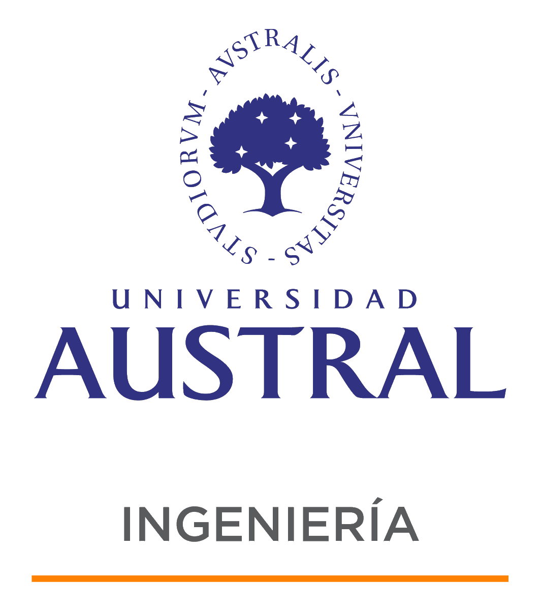

# Navegación Autónoma de Drones Urbanos con Visión Monocular y Small Language Model (SLM)

### Tesis para Magister en Ciencia de Datos 

#### Maestría en Ciencia de Datos - 2024/2025

Directores:

-   [DEL ROSSO, Rodrigo](https://www.linkedin.com/in/rodrigodelrosso/)
-   [NUSKE, Ezequiel](https://www.linkedin.com/in/ezequiel-nuske-15137862/)

Alumno:

-   [NICOLAU, Jorge Enrique](https://www.linkedin.com/in/jorgenicolau/)
